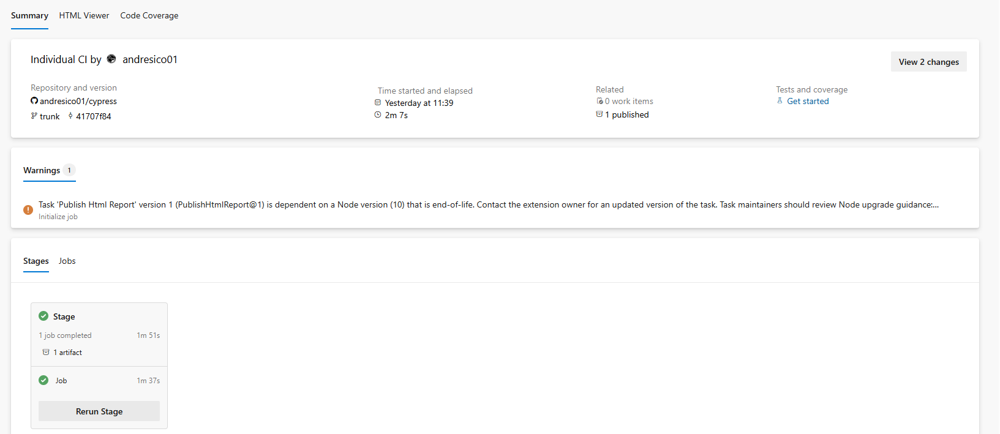
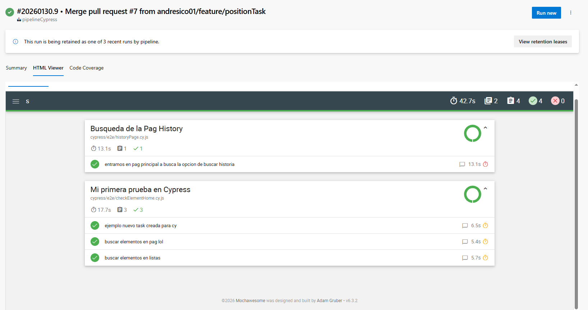

# Cypress E2E Automation Project

This project contains End-to-End tests developed with Cypress for automated web testing.

## Description

This automation suite is configured to run tests against the [League of Legends](https://www.leagueoflegends.com/) website. It includes examples of common Cypress commands and a basic structure for organizing test files, selectors, and reusable tasks.

It also includes custom configurations for:
* **Centralized Reporting:** HTML reports and screenshots are consolidated in a single directory.
* **Create a custom fuction for cy:** Custon fuction that let us take a picture in the step that we need.
* **Smart Scrolling:** Custom algorithms to handle non-scrollable elements.
* **Webpack Aliases:** Simplified imports using `@tasks`, `@ui`, etc.

## Getting Started

### Prerequisites

You need to have [Node.js](https://nodejs.org/en/) and npm installed on your machine.

### Installation

1. Clone the repository to your local machine.
2. Navigate to the project directory.
3. Install the required dependencies by running the following command:
   ```bash
   npm install or npm ci
   ```

## Running the Tests

To run the tests, you can use the Cypress Test Runner. Open it with the following command:

```bash
npx cypress open
```

This will open the Cypress interface, where you can see and run all the test files (`.cy.js`) found in the `cypress/e2e` directory and execute one script to run the test:

## Project Structure

The project follows the standard Cypress folder structure:
```
CypressProject/
│   .babelrc
│   .gitignore
│   cypress.config.js            # Main Configuration (BaseURL, Timeouts, Reporter)
│   estructura.txt
│   jsconfig.json                # Intellisense Configuration
│   package-lock.json
│   package.json                 # Dependencies & Scripts
│   pipeline-ci.yaml             # CI/CD Pipeline Definition
│   README-ENG.md
│   webpack.config.js            # Path Aliases Configuration
|   
│
├── cypress/
│   ├── e2e/                     # Contains the actual test files (`.cy.js`).
│   │       checkElementHome.cy.js
│   │       historyPage.cy.js
│   │
│   ├── fixtures/                # Used to store test data that can be used in the tests. in this project is not used 
│   │       example.json
│   │
│   └── support/                 # Support Code & Screenplay Pattern
│       │   commands.js          # Custom Commands (e.g., cy.centerElement,cy.evidence)
│       │   e2e.js               # Global Hooks
│       │
│       ├── questions/           # Assertions (Validations)
│       │       elementQuest.js
│       │
│       ├── tasks/               # Actions (Business Logic)
│       │       historyTask.js
│       │       homeTask.js
│       │
│       ├── ui/                  # UI Selectors (Page Objects)
│       │       historyTarget.js
│       │       homeTarget.js
│       │
│       └── utils/               # Helpers & Wrappers
│               imageEvidence.js
│
+---evidencia
|   +---reporte
|   |       index.html
|   |       
|   \---screenshots
|       +---checkElementHome.cy.js
|       \---historyPage.cy.js
\---readme
        htmlViewer.png
        pipelineExecution.png
        
```

## ⛓️ CI/CD Pipeline Integration
The project includes a pipeline-ci.yaml file configured for Azure DevOps. 
It handles environment setup, execution, and artifact publication.
 1. Execute all the test case. 
 2. Create a report 
 3. save the report in the pipeline execution 

* **pipeline execution:**
<p align="center">
  
</p>

* **show report:**
<p align="center">
  
</p>

This project contains End-to-End tests developed with **Cypress**...


